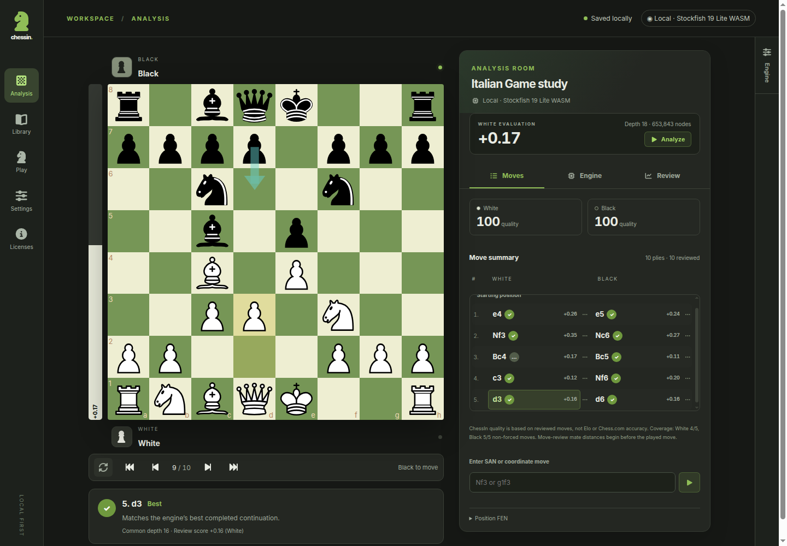

<p align="center"></p>

<h1 align="center">Chess analysis that stays yours.</h1>

<p align="center">Study a game, understand a move, or play Stockfish. ChessIn is a local-first, installable chess workspace: your library stays on your device, and connecting a remote engine is always your choice.</p>

<p align="center"><a href="https://chessin.knn07.workers.dev"><strong>Open ChessIn</strong></a> · <a href="https://github.com/KNN-07/ChessIn">Source on GitHub</a> · <a href="https://github.com/KNN-07/ChessIn/issues">Report an issue</a> · <a href="#run-locally">Run locally</a> · <a href="#deploy-the-web-app-to-cloudflare">Deploy</a></p>



## What you can do

- **Analyze without an account.** Switch between Moves, Engine and Review beside a responsive board. Paired White/Black notation, persistent navigation, a White-oriented evaluation bar and selected-move feedback keep the position and its evidence together. Import PGN variations/comments, paste FEN and export your annotated game; your library stays in your browser.
- **Review with evidence.** Compare White/Black **ChessIn quality** cards, classification counts and a selectable evaluation graph. Inspect the actual common depth and best continuation in Overview or Moves. A **Brilliant** move uses an explicitly labeled *engine-backed sacrifice heuristic*, not a claim of perfect chess understanding. Incomplete or bounded comparisons remain **Uncertain**; ChessIn quality is not Chess.com accuracy or an Elo rating.
- **Play at your pace.** Preview the board, choose your color and time-control cards, and switch between New game, Engine and Rules before starting. Casual games have real clocks, paired notation and a Game details tab; completed games open directly in review. No matchmaking or disguised engine hints during play.
- **Choose where the engine runs.** Local Stockfish.js is the default; the lite single-thread engine is a separate, explicit ~1.8 MB download. Stronger/full and threaded builds are optional. An operator-run native UCI API can serve a trusted group, but ChessIn never silently sends local analysis to it.
- **Keep working offline.** After the app shell is controlled and a complete engine pair is installed, local analysis can work offline. Browser storage is fallible: export important PGNs and check the app's honest offline/storage status.

## Run locally

Use Node.js 24 and npm. The committed lockfile pins the JavaScript dependencies.

```sh
npm ci
npm run prepare:engines
npm run build
npm run preview -- --host 127.0.0.1 --port 4173
```

Open [http://127.0.0.1:4173](http://127.0.0.1:4173). For development, run `npm run dev` (port 5173). Engine preparation fetches and verifies pinned Stockfish.js 19.0.0 binaries **and their corresponding source/build inputs**; the deployment bundle is several hundred MB, but visitors download only the engine profiles they choose. The web app works without the optional native API. Build the production app to verify offline behavior; Vite development mode is not an offline-install proof.

## Deploy the web app to Cloudflare

```sh
npm ci
npm run deploy:cloudflare
```

Authenticate Wrangler with your Cloudflare account when prompted. `npm run deploy:cloudflare` prepares the pinned engines, builds the app, stages Cloudflare assets and deploys the `chessin` Worker from a fresh checkout. The Worker publishes the local-first web app and its GPL corresponding-source downloads; it does **not** run native engine subprocesses. Its build staging splits large files into internally hosted parts to fit Cloudflare's static-asset limit, then serves the **exact original bytes at the original URLs**. No R2 bucket, paid service or third-party engine CDN is needed at runtime. Browser engine downloads remain opt-in. For remote native analysis, operate the separate Docker/API server on an appropriate host and connect explicitly from ChessIn over HTTPS; the Cloudflare Worker is not a substitute for that process host.

<details>
<summary><strong>Board, library and browser storage</strong></summary>

Import multiple standard-chess PGNs with recursive variations, comments and NAGs, or paste a FEN. Imports are transactional, limited to 2 MiB, 100 games, 20,000 nodes and variation depth 32. Other chess variants are rejected; a FEN cannot reconstruct prior repetition history.

Drag a piece, tap source and target, or enter SAN/UCI in the labeled move input. Both pointer methods offer queen, rook, bishop and knight promotion. Arrow keys navigate moves outside form controls. A different continuation creates a variation, which you can promote to the main line. Deleting a branch or game requires confirmation. Flipping the board/bar does not change White-positive score meaning.

The move list keeps the selected move visible without scrolling the whole page. Move-review scores describe the played continuation from its **parent** position; their mate distances begin before that move. They are labeled separately from live position evaluations. Terminal board evaluations follow chess rules, and changing a game tree or engine configuration clears incompatible move evidence.

The **Engine** tab on the far-right screen edge opens quick analysis settings: depth/time presets, continuous search and the engine's supported line count. It stays separate from the Moves/Engine/Review content tabs and closes with Escape. Downloads, hardware limits, connection credentials and app installation remain on the full Settings page, reached through **Open full Settings**. Quick analysis controls are disabled in Review, which has its own search settings.

IndexedDB stores games, preferences and reviews. Saves await transaction completion; simultaneous edits in another tab become separate copies rather than overwriting the other version. If storage is blocked or full, the current board remains in memory and shows **Unsaved** with PGN export. Browser storage is not a backup. PGN export preserves the tree; FEN copy reflects the selected position.

</details>

<details>
<summary><strong>Local engines, offline installation and privacy</strong></summary>

`prepare:engines` verifies all eight unchanged Stockfish.js 19.0.0 release files against committed SHA-256 metadata and collects corresponding browser/native source archives and NNUE build inputs. Clients do not automatically download engine files. Download a profile in Engine settings or explicitly choose **Run online without offline storage**. Full profiles are ~99 MB each; stronger profiles, threads, hash and MultiPV consume CPU, memory and battery. Single-thread builds stay at one thread. Threaded builds require cross-origin isolation and SharedArrayBuffer; lite-single remains available without them.

**Ready offline** requires both a controlled app shell and a verified, complete JS/WASM cache pair. A first install may need a reload for app-shell control; browser eviction may require another download. No games are deleted to make engine space. Install through the browser prompt when available, or Safari's Share → Add to Home Screen.

Local analysis, review and play do not send positions/history to a remote service. Remote connection requires explicit consent, an endpoint, an in-memory bearer token, catalog discovery and engine selection. Only each requested position/history and structured engine settings are transmitted. Tokens are never stored in local settings, PGN, CacheStorage or exports and must be re-entered after reload. The endpoint and chosen engine ID are remembered, but no automatic reconnect or local-to-remote fallback occurs.

Search controls intersect advertised UCI bounds with product limits. Analysis/review reset supported weakening controls to full strength. Scores shown to users are White-oriented; wire/review scores retain the root side-to-move orientation, with mate/bound information intact. Each search sends the root FEN and complete legal move path. Superseding a search waits for its old bestmove and a readiness fence. Hidden analysis/review pauses until you resume. Local Clear Hash restarts that engine; each remote request gets a fresh process/hash.

</details>

<details>
<summary><strong>How review and casual play work</strong></summary>

Review compares exact, completed MultiPV snapshots at the greatest common depth. If the played move was not a candidate, ChessIn performs a restricted search from the same pre-move position. Bounds, missing/incomplete comparisons and depth below 10 remain **Uncertain**. Defaults are depth 16 and at most 3000 ms per search; actual achieved depth is displayed. Pause, resume, cancel and completed progress are stored locally. A changed tree, engine, settings or review algorithm invalidates prior results; simply selecting another position does not.

**Brilliant** requires a top move at depth ≥14, small loss, and a legal six-ply sacrifice prefix meeting material criteria. It is an engine-backed heuristic, not proof. **ChessIn quality** is `round(mean(100 * exp(-min(lossCp,1000)/200)))` over completed graded non-forced moves per side, with coverage disclosed. It is neither Chess.com accuracy nor Elo.

Play offers White/Black/Random, Untimed/3+2/5+0/10+0 or custom 1–180 minutes and 0–60 seconds increment. Skill/Elo controls appear only when advertised by the selected engine. Engine/profile/strength are fixed for an active game; analysis hints are hidden. Clocks use monotonic and wall deadlines, add increment only after a legal move and reject late moves. Reload charges elapsed wall time and then requires explicit Resume. Engine interruption freezes the debited clocks pending explicit recovery with the same provider/profile or abandonment. Leaving the page offers Stay or Suspend.

Casual games draw automatically on threefold repetition or 100 reversible halfmoves, with checkmate taking priority. Timeout is a draw when the opponent has insufficient mating material by the documented python-chess-style material rule, not an exhaustive dead-position solver. **Finish and Review** opens the saved game.

</details>

<details>
<summary><strong>Optional trusted-group native API</strong></summary>

The native API is independent of the Worker and static site. To run directly, install a compatible native Stockfish binary and set its path:

```sh
export CHESSIN_API_TOKEN="$(node -e "console.log(require('node:crypto').randomBytes(32).toString('hex'))")"
export STOCKFISH_PATH=/absolute/path/to/stockfish
npm run start:server
```

`npm run dev:server` starts a development watcher. Configure the server deliberately:

| Variable | Default |
| --- | --- |
| `CHESSIN_API_TOKEN` | Required, at least 32 characters; no bundled default |
| `CHESSIN_HOST` / `CHESSIN_PORT` | `127.0.0.1` / `8787` |
| `CHESSIN_ALLOWED_ORIGINS` | Exact localhost/127.0.0.1 origins on ports 5173 and 4173 |
| `STOCKFISH_PATH` | `/opt/stockfish/stockfish-linux-x86-64-universal` |
| `CHESSIN_ENGINE_CONFIG` | Optional administrator JSON path |
| `CHESSIN_MAX_CONCURRENT` | `2` |
| `CHESSIN_MAX_JOB_MS` | `300000` |
| `CHESSIN_MAX_THREADS` / `CHESSIN_MAX_HASH_MB` | `4` / `256` |

`engines.example.json` documents the administrator-only executable catalog. Absolute executable/cwd paths and startup UCI options can configure other compatible engines with locally installed weights. Each configured binary must pass startup probing. LCZero/GPU assets are not bundled. Clients select catalog IDs, never arbitrary paths, engine options, files or download URLs. Rotate the shared token in server configuration and restart.

`GET /healthz` is unauthenticated. `GET /v1/engines` and `POST /v1/analyze` require `Authorization: Bearer …`. Analysis uses strict JSON requests and newline-delimited `EngineEvent` JSON responses; see `packages/core/src/engine.ts` and `packages/core/src/protocol.ts`. Pre-stream errors use `{error:{code,message}}`; post-stream failures are terminal events. Abort the fetch to cancel. Unlisted browser origins receive 403; authenticated origin-less CLI clients work. Full capacity rejects immediately with 429; streaming buffers and process cleanup are bounded. Use HTTPS for real remote clients and keep the bearer token within your trusted group.

</details>

<details>
<summary><strong>Docker deployment and operator security</strong></summary>

```sh
export CHESSIN_API_TOKEN="$(node -e "console.log(require('node:crypto').randomBytes(32).toString('hex'))")"
docker compose up --build
```

Open [http://127.0.0.1:8080](http://127.0.0.1:8080). Compose fails closed without the token. nginx serves the static web app and proxies `/v1/` and `/healthz`; the API port remains internal. The server runs nonroot with a read-only root filesystem, `/tmp` tmpfs, dropped capabilities, no-new-privileges, init/reaping, 2 GiB memory, four CPUs and a 128-PID limit. The native Stockfish `sf_19` amd64/arm64 archives are verified before extraction; unsupported architectures fail the build. The supplied `/opt/stockfish` source/license directory is retained.

For LAN/external phones, use a real HTTPS TLS reverse proxy and set `CHESSIN_ALLOWED_ORIGINS` to the exact frontend origin. Proxy the frontend and `/v1/`/`/healthz`, retain `Cross-Origin-Opener-Policy: same-origin` and `Cross-Origin-Embedder-Policy: require-corp`, disable analysis response buffering and allow a 310-second stream timeout. There is no certificate bypass or plain-HTTP LAN PWA/remote mode. Compose binds the web port to loopback by default; do not expose the bearer API publicly by accident.

Static-only hosting is also supported: publish `apps/web/dist` under HTTPS, add SPA fallback for app navigation **only** (not missing engine/source/API assets), serve correct JS/WASM MIME types and preserve the isolation headers. The included nginx configuration is for Compose and references its optional API service; remove API proxy locations when using standalone nginx. Without isolation, lite-single still works and threaded profiles are disabled.

</details>

<details>
<summary><strong>License, corresponding source and development checks</strong></summary>

ChessIn is [GPLv3](LICENSE). Stockfish.js © 2026 Chess.com, LLC, port by Nathan Rugg, and Stockfish © its developers. The app's Licenses screen links locally served licenses, complete author lists, source archives, network inputs and build instructions. `prepare:engines` creates `public/sources/README.txt` with browser/native build commands and collects installed-package notices, including the licensed built-in board pieces.

`npm run build` packages application source, lockfile and deployment scripts as `/sources/chessin-source.tar.gz`, excluding binaries, generated caches, environment files and logs. Keep the corresponding-source files available alongside binary distributions; upstream links alone are not the distribution. Do not remove `/sources` to shrink a public deployment unless you provide equivalent GPL-compliant corresponding source.

`npm run typecheck` checks both applications; `npm test` runs the deterministic Vitest regressions for PGN/game legality, UCI protocol boundaries, review and timed-play rules. These checks supplement, rather than replace, real browser and native-engine verification. The ChessIn logo is original. Navigation and settings use [Font Awesome Free](https://fontawesome.com/search?ic=free) SVG icons, bundled locally for offline use rather than loaded from a CDN. Font Awesome's icon/code licenses are included in the app's third-party notices.

</details>
